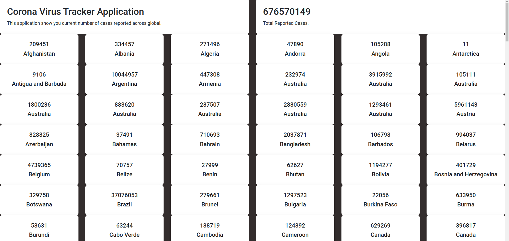

# Corona Tracker Application

Created a statis web pages where we can see  counting of all Corona virus affected patient globally.

## Technology Used 

- Spring Boot
- Thymeleaf
- HTML
- CSS

Data Set - https://raw.githubusercontent.com/CSSEGISandData/COVID-19/master/csse_covid_19_data/csse_covid_19_time_series/time_series_covid19_confirmed_global.csv

## ScreenShot

## Authors

